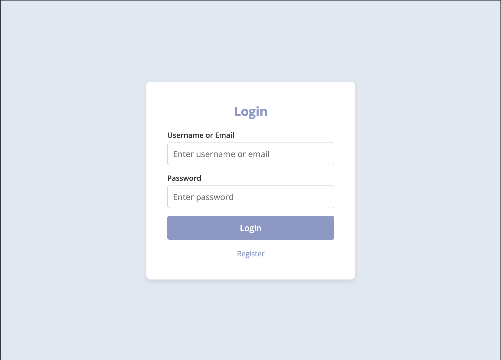
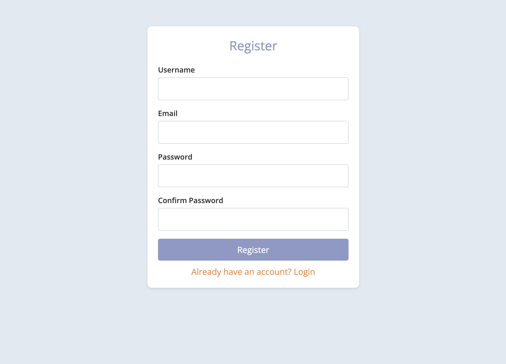
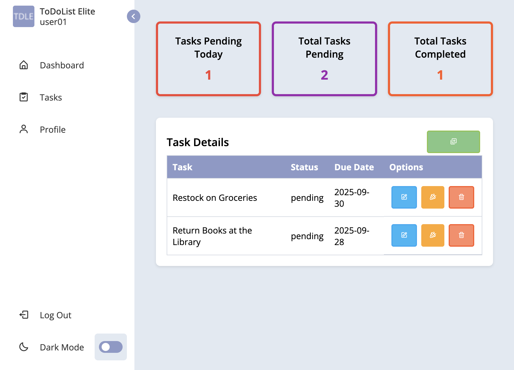
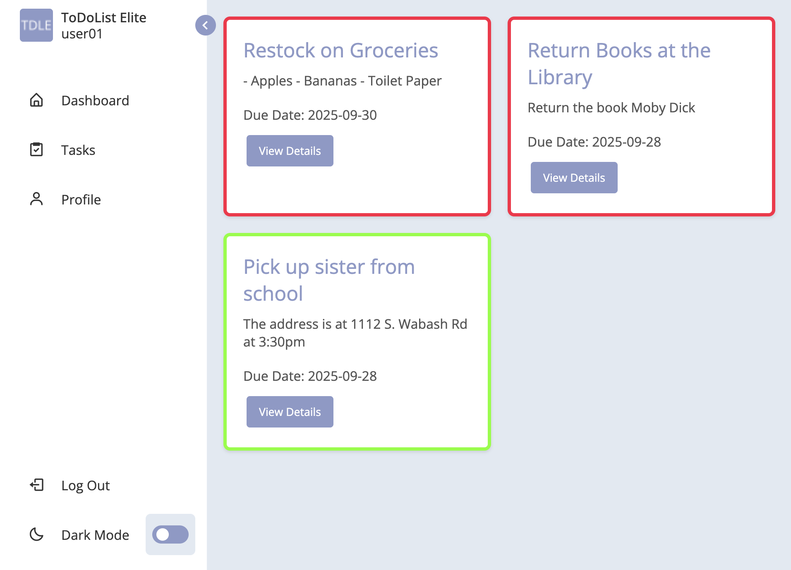
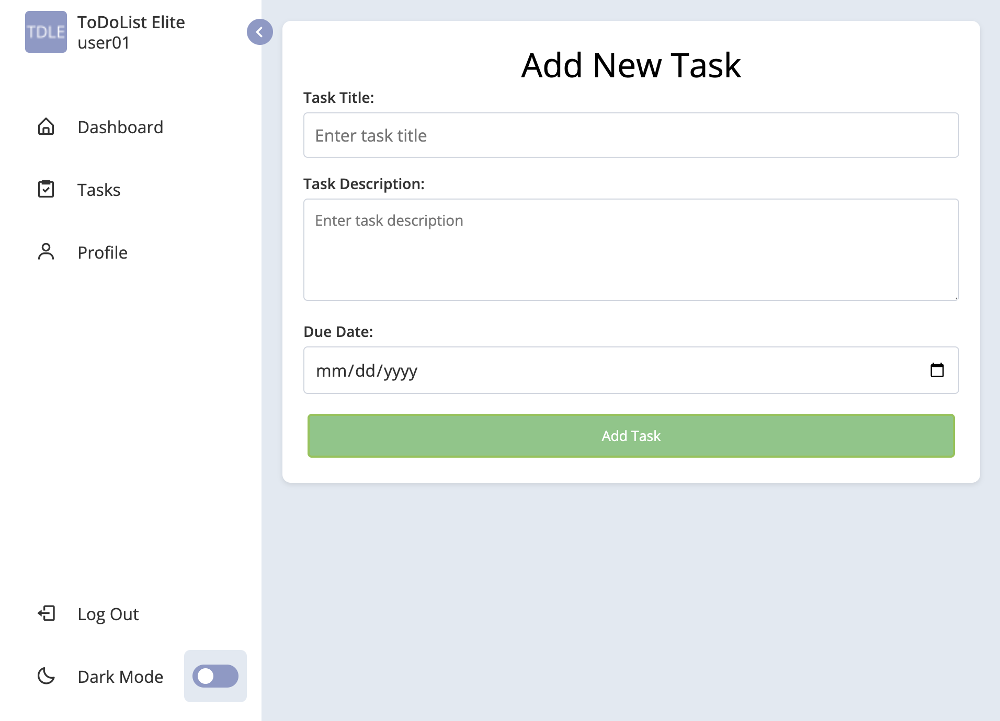
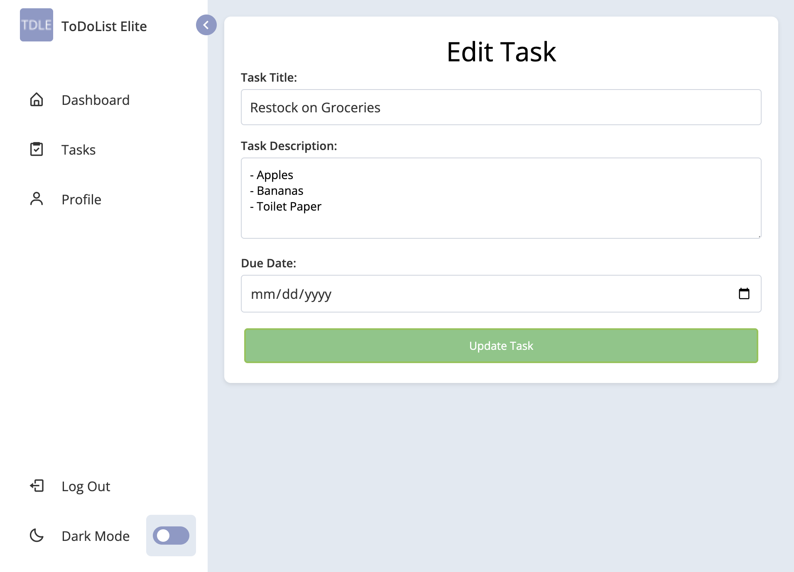
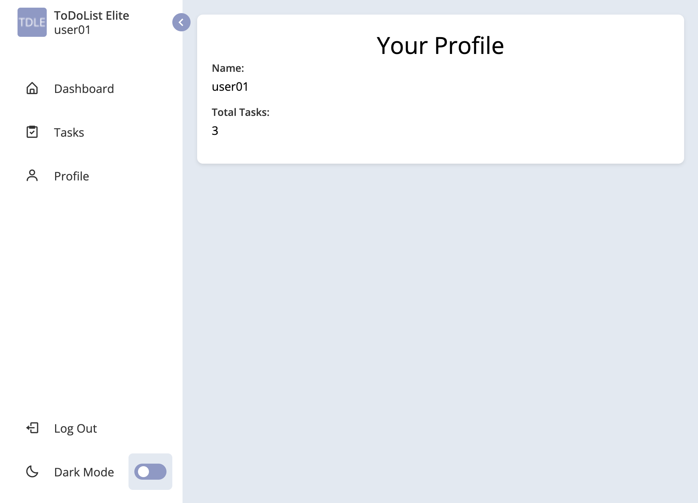

# ToDoRails Task Management Web Application

## About the Project

### Introduction
In today’s fast-paced world, keeping track of tasks and priorities can be challenging. The **ToDoRails** is a web application designed to help users create, organize, and manage their tasks in a secure and user-friendly environment.

This project focuses on building a strong, reliable backend for a task management application using **Java**, **Spring Boot**, and **MySQL**, while implementing best practices in security, error management, and clean code.

## Purpose of the Project
The primary purpose of this project is to provide hands-on experience in building a **secure and scalable backend** for a personalized task management system. 

## Key Features

### Security
- User authentication using **Spring Security**.
- Role-based authorization (e.g., `USER` and `ADMIN` roles).
- Password encryption and secure storage.

### User Management
- User registration and login functionality.
- Validation for duplicate usernames and emails.
- Secure access to personalized task data.

### Task Management (CRUD)
- Create, read, update, and delete tasks.
- Robust server-side validation for task inputs.
- Accurate database interactions using **MySQL**.

### Validation & Logging
- Input validation with meaningful error messages.
- Logging for critical operations and error handling.

### Testing & Code Quality
- Unit and integration tests using **JUnit** and **MockMvc**.
- Targeted test coverage of at least **80%** for service and controller classes.
- Clean, maintainable, and scalable code adhering to best practices.

## Technologies & Components
| Technology | Role |
|------------|------|
| **Java & Spring Boot** | Core backend development and server-side logic |
| **Spring Security** | User authentication, password encryption, and role-based authorization |
| **RESTful API** | Client-server communication and task/user management |
| **MySQL** | Database management and persistence |
| **JUnit & MockMvc** | Unit and integration testing for reliability and functionality |

## Screenshots

### Login Page

### Registration Page

### Dashboard

### Task Management

### Add New Task

### Edit Task

### User Profile

